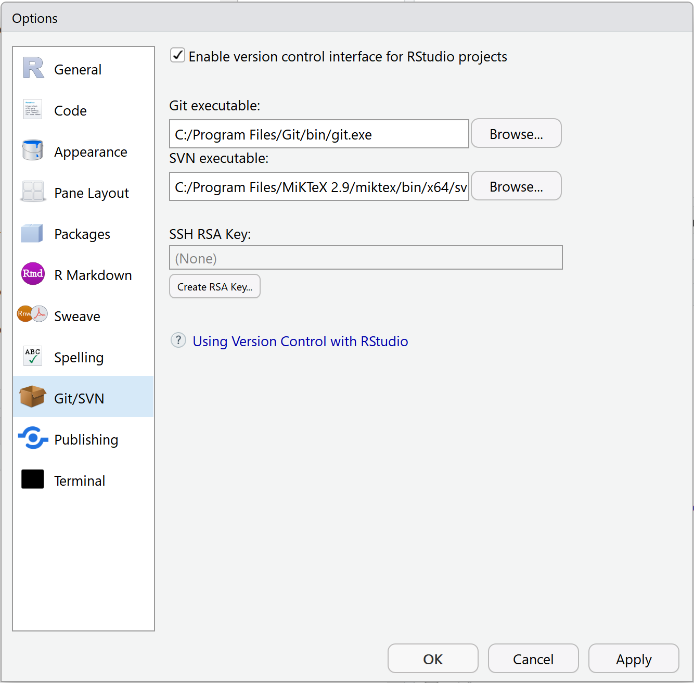
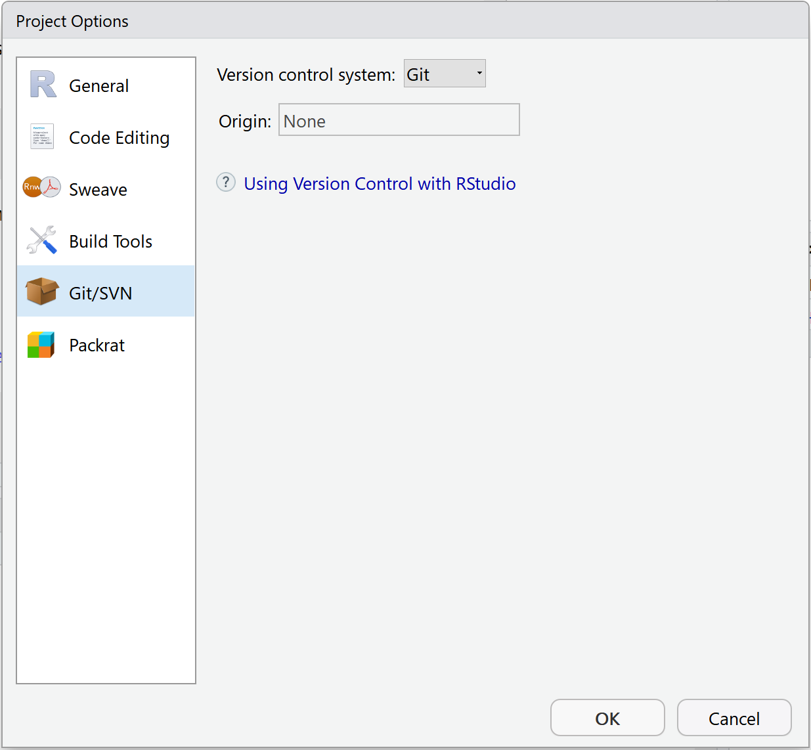

<!-- Options de knitr et de R (librairies, ...) --> 

```{r Options, echo=FALSE, message=FALSE}
knitr::opts_chunk$set(echo = TRUE, tidy=TRUE, tidy.opts=list(blank=FALSE, width.cutoff=50), out.width='.8\\maxwidth')
options(width=50)
# Installation des packages si nécessaire et chargement
Library <- function(Packages) {
  InstallAndLoad <- function(Package) {
    if (!Package %in% installed.packages()[, 1]) {install.packages(Package, repos="https://cran.rstudio.com/")}
    require(Package, character.only = TRUE)
  }
  invisible(sapply(Packages, InstallAndLoad))
}
# Ajouter les packages nécessaires ici
Library(c("kableExtra", "tidyverse", "secret"))
```

<!-- Début du document ci-dessous --> 


# Introduction

_git_ est devenu l'outil standard de contrôle de source.
Il est complètement intégré à RStudio, ce qui le rend simple à utiliser au-delà de son audience historique de développeurs.
Enfin, _GitHub_ est devenue la plateforme de partage de code dominante, avec des services haut de gamme et gratuits comme la fourniture d'un site web de présentation pour chaque projet, l'accès à des outils d'intégration continue comme _TravisCI_ et _CodeCov_.

Une documentation détaillée se trouve dans [Happy Git and GitHub for the useR](http://happygitwithr.com/).
Ce document renvoie aux chapitres de cet ouvrage pour les détails.

# Installation

Le logiciel [_git_](https://git-scm.com/) doit être installé[^1] sur le poste de travail exécutant RStudio.

[^1]: <http://happygitwithr.com/install-git.html>

_git_ fonctionne en tâche de fond sur l'ordinateur après son installation.
Il sera utilisé dans RStudio et parfois à partir de sa console : _Git Bash_.

```{r R-git, echo=FALSE, out.width='70%'}

```

Si _git_ est installé correctement, RStudio le détecte et affiche son chemin dans les options globales.

Il est temps de paramétrer git avec son nom et son adresse en ouvrant une console _Git Bash_ et en tapant les commandes suivantes :

```
git config --global user.name 'Eric Marcon'
git config --global user.email 'e.marcon@free.fr'
```

Il est aussi nécessaire d'ouvrir un compte sur [GitHub](https://github.com)[^2], avec la même adresse de messagerie que celle déclarée localement.

[^2]: <http://happygitwithr.com/github-acct.html>


# Projet R sous contrôle de source

Tout projet RStudio peut être passé sous contrôle de source par le menu _Tools/Version Control/Project Setup..._ et en sélectionnant _git_ dans la liste déroulante _Version Control System_.

```{r Project-git, echo=FALSE, out.width='70%'}

```

Une fenêtre supplémentaire _Git_ apparaît dans le même groupe que _Environment._

## Principes

Tout fichier du projet peut être suivi.
Il doit d'abord être ajouté ; par la suite, il sera pris en compte (_staged_) ou non à chaque livraison (_commit_) des modifications, à réaliser à la fin de chaque séance de travail.

_git_ maintient un historique de toutes les modifications apportées à chaque fichier du projet : l'unité d'information est la ligne dans les fichiers texte.

Pour travailler à plusieurs, rendre un projet visible ou simplement assurer sa sauvegarde, il est nécessaire de le mettre en ligne dans un dépôt, généralement sur la plateforme _GitHub_.
La synchronisation entre le dépôt GitHub et sa copie locale se fait par la commande _Pull_, la commande _Push_ fonctionne dans l'autre sens.

Une session de travail dans un projet collaboratif commence donc par un _Pull_ pour obtenir localement les modifications faites par les autres membres du projet.
Après une modification, les changements sont livrés (_commit_) puis remontés sur le dépôt par un _Push_.

## Commencer

La méthode la plus simple consiste à créer un dépôt sur _GitHub_ puis créer un projet dans RStudio à partir de ce dépôt[^1].

[^1]: http://happygitwithr.com/new-github-first.html

Si le projet existe déjà mais n'est pas sous contrôle de source, la même méthode s'applique : il suffit de coller l'ensemble des fichiers préexistants dans le nouveau projet[^2].

[^2]: http://happygitwithr.com/existing-github-first.html

Si le projet existe déjà et est sous contrôle de source, des précautions sont nécessaires pour ne pas perdre son historique[^3]. 

[^3]: http://happygitwithr.com/existing-github-last.html#make-and-connect-a-github-repo-option-2


## .gitignore

Les projets R génèrent de nombreux fichiers de travail, qui ne doivent pas être pris en compte par _git_.
Le fichier `.gitignore` permet de lister ces fichiers par leur nom ou un masque (exemple : `*.aux` pour les fichiers auxiliaires de LaTeX).
Dès le début du développement du projet, il faut compléter le fichier `.gitignore` pour éliminer de la fenêtre _Git_ de RStudio tout fichier de statut inconnu (_Status_ affiche deux points d'interrogation) : les fichiers doivent être pris en compte (_staged_) ou ignorés (leur ajout dans `.gitignore` les fait disparaître).

# Données confidentielles dans un dépôt public

Le partage sur _GitHub_ dans un dépôt public pose problème quand des données utilisées dans le projet ne sont pas publiques.

Une solution peu satisfaisante consiste à ne pas inclure les données au projet, ce qui le rend non reproductible.
Une meilleure solution est de les crypter, en permettant à certains utilisateurs de les décrypter.
C'est l'objet du package _secret_.

Un coffre-fort (dossier `vault`) est créé dans le projet.
Il contient la liste des utilisateurs autorisés à décrypter une partie de son contenu : ces utilisateurs sont identifiés par leur clé publique.
Les utilisateurs utilisent ensuite leur clé privée pour le décryptage.


## Préalables

Chaque utilisateur du coffre-fort doit détenir une clé privée et la clé publique correspondante.
Ces clés sont normalement stockées dans le dossier `~/.ssh`, quel que soit le système d'exploitation, mais l'emplacement du dossier personnel `~` est ambiguë sous Windows : pour R, c'est le dossier `Documents`, mais pour d'autres logiciels, c'est le dossier racine de l'utilisateur, parent de `Documents`.

### Génération d'une paire de clés

Les clés sont générées par le logiciel _ssh_, installé avec _git_ ou par défaut sous Linux.
Pour générer une clé au format RSA :

- exécuter, dans _Git Bash_ : ```ssh-keygen -t rsa -b 4096 -C "my_email@example.com" ``` en remplaçant le modèle d'adresse de messagerie par son adresse réelle.

- Accepter l'emplacement de fichier par défaut pour stocker la clé.

- Saisir une phrase de validation (mot de passe) pour sécuriser l'utilisation de la clé.

La clé privée peut être utilisée pour sécuriser de nombreuses applications.
Elle doit être sauvegardée dans un emplacement sûr et ne pas être accessible par les tiers.
La clé publique, `~/.ssh/id_rsa.pub`, peut être diffusée.

Sous Windows, le répertoire `~` correspond à `Documents` mais _Git Bash_ a créé le dossier `.ssh` à la racine du profil de l'utilisateur.
Il faut donc déplacer le dossier (avec l'explorateur de fichiers) dans `Documents`.

Le bon fonctionnement de la clé peut être testé.

```{r, eval=FALSE}
library("secret")
local_key()
```

L'appel à la fonction `local_key()` fait apparaître une fenêtre pour la saisie du mot de passe : elle ne peut être utilisé qu'en mode interactif sous R.


### Copie de la clé publique sur GitHub

Sur le site _GitHub_, après s'être authentifié, afficher les paramètres du compte (menu déroulant _Settings_), sélectionner _SSH anfd GPG keys_ et cliquer sur le bouton _New SSH Key_.
Donner un nom à la clé (par exemple "Principale") coller le contenu de `~/.ssh/id_rsa.pub` dans le formulaire.

Cette clé pourra être récupérée par le créateur d'un coffre-fort pour donner des droits à un utilisateur GitHub.


## Utilisation d'un coffre-fort

### Création d'un coffre-fort

```{r}
# Suppression des coffres-forts préexistant
unlink("vault", recursive = TRUE, force = TRUE)
unlink("vault2", recursive = TRUE, force = TRUE)
```


Créer le coffre-fort du projet avant d'y déposer des données.
```{r}
# Coffre-fort dans le dossier "vault"
vault <-  "vault"
create_vault(vault)
```

L'opération a simplement créé le dossier `vault` avec un sous-dossier pour les utilisateurs et un autre pour les données (`secrets`).


### Ajout d'utilisateurs

La première opération à réaliser est de s'ajouter soi-même à la liste des utilisateurs, au choix :

- à partir de sa clé publique, locale (`~/.ssh/id_rsa.pub`) :
```{r}
library("openssl")
add_user(email="e.marcon@free.fr", public_key=read_pubkey("~/.ssh/id_rsa.pub"), vault = vault)
# Vérification
list_users(vault = vault)
# Suppression 
delete_user("e.marcon@free.fr", vault = vault)
```
- à partir de son identifiant _GitHub_ :
```{r}
# Ajout
add_github_user("EricMarcon", vault=vault)
# Vérification
list_users(vault = vault)
```


### Ajout de données

Les données sont appelées _secrets_.
Un secret contient une seule variable R mais doit recevoir un nom.
Les utilisateurs ayant accès au secret sont déclarés par leur nom, dans un vecteur.

```{r}
MySecret <- "Texte secret"
add_secret("MonSecret", value = MySecret, users = "github-EricMarcon", vault = vault)
```


### Liste des secrets

La liste des secrets, celle des utilisateurs et celle des propriétaire d'un secret sont disponibles.

```{r}
list_secrets(vault = vault)
list_users(vault = vault)
list_owners("MonSecret", vault = vault)
```


### Décryptage

Pour décrypter les données, il faut disposer d'une clé privée correspondant à une des clés publiques autorisées.

```{r, eval=FALSE}
get_secret("MonSecret", key = local_key(), vault = vault)
```

Ce code ne peut être exécuté qu'en mode interactif pour saisir le mot de passe de la clé privée.


## Utilisation réelle

Le propriétaire du projet contenant les données confidentielles crée un coffre-fort et y stocke les données avant de pousser le projet sur _GitHub_.

Le décryptage des données nécessite une clé privée.
Les clés privées des utilisateurs doivent impérativement être protégées par mot de passe : l'accès au fichier par un tiers est toujours possible sur le disque dur ou dans le cadre d'une sauvegarde.
L'exécution du code R en mode non-interactif (le tricotage d'un fichier Rmarkdown par exemple) ne permet pas la saisie de ce mot de passe.
La bonne pratique consiste à créer une paire de clé spécifique à chaque projet dont la clé privée, non protégée par mot de passe, ne sera pas stockée sur GitHub.
La clé privée non protégée permet de tricoter le fichier sur le poste de travail du propriétaire du projet.
Elle peut être distribuée aux utilisateurs ayant besoin de reproduire l'exécution du code (par exemple une salle de classe), ce qui est plus simple que l'ajout de chaque utilisateur dans le coffre-fort.
Elle est vulnérable : elle peut par exemple être diffusée par un étudiants, mais les conséquences d'une compromission de la clé sont limitées au décodage des données du projet.
Il suffit de retirer l'utilisateur correspondant du coffre-fort et de régénérer une nouvelle paire de clé pour sécuriser à nouveau le projet.

La création de la clé du projet a lieu dans _Git Bash_ avec la commande ```ssh-keygen -t rsa -b 4096```.
Spécifier le chemin du fichier : il doit être placé dans le dossier du projet son nom doit être celui du projet RStudio suffixé par `_rsa` (exemple : `Cours-git_rsa`).
Ne pas saisir de mot de passe.
Ajouter une ligne `*_rsa` dans le fichier `.gitignore` pour ne pas stocker la clé privée sur dans le dépôt git.

La clé publique est ajoutée à la liste des utilisateurs du coffre-fort et les secrets sont partagés.

Le script suivant permet de créer un coffre-fort dont les données sont lisibles avec la clé privée du projet.

```{r}
# Création du coffre-fort
vault2 <- "vault2"
create_vault(vault2)
# Utilisateur correspondant au projet
ClePubliqueDuProjet <- read_pubkey("Cours-git_rsa.pub")
add_user("Cours-git", public_key = ClePubliqueDuProjet, vault = vault2)
# Propriétaire du projet
add_github_user("EricMarcon", vault = vault2)
# Données
MySecret <- "Texte secret 2"
# Création du secret, avec deux utilisateurs : le propriétaire du projet et l'utilisateur correspondant au projet
add_secret("MonSecret", value = MySecret, users = c("github-EricMarcon", "Cours-git"), vault = vault2)
# Vérification
list_owners("MonSecret", vault = vault2)
# Décryptage, sans interaction
get_secret("MonSecret", key = read_key("Cours-git_rsa"), vault = vault2)
```

Le secret peut être lu avec la clé du projet, qui ne nécessite pas d'interaction.


## Partage du secret

De nouveaux utilisateurs peuvent être ajoutés au coffre-fort à tout moment et un secret peut être partagé avec eux par la fonction `share_secret`.
Cette commande nécessite une clé _privée_ d'un propriétaire du secret parce qu'elle décrypte les données avant de les encrypter à nouveau avec leurs nouvelles autorisations.

La fonction `unshare_secret` permet de retirer des utilisateurs du partage.


Enfin, la commande `update_secret` permet de mettre à jour une donnée cryptée. 
Elle nécessite une clé privée.

